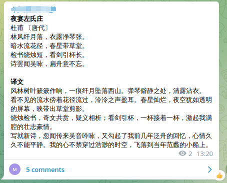

# rachel_everyday_poem

## 简介
Rachel want a Chinese poem everyday.
这是一个古诗项目，计划使用爬虫获取我的每日古诗。数据源是古诗词网，如有侵权，请联系 [me@inzamz.top](mailto:me@inzamz.top)
删除。项目计划暂时部署在服务器上，不对外开放。后续可能完善接口后开放。
你可以直接读取仓库的 poem 目录下的 json 文件获取诗文，~~后续可能探索使用 Github Action 的可能性~~。

## 功能

获取古诗词网首页的名句对应的原文，网站不定时更新，每天会更新几次。~~由于 Rachel 每天只要一首诗，所以不需要太多~~
。使用爬虫获取原文，作者，译文，注释，赏析和创作背景。最终以 json 形式写入文件中。可以调用相关程序发送至 Telegram Channel 。

## TODO

- [ ] 语音链接的获取
- [ ] 作者图片的获取
- [ ] 配图图片的获取
- [ ] 随机获取古诗
- [ ] 数据库的持久化储存
- [x] Telegram Bot支持
- [ ] 判断古诗重复
- [ ] 增加搜索条件

## How to use

代码参考 [jsoma/selenium-github-actions](https://github.com/jsoma/selenium-github-actions)，使用了 `webdriver_manager`
库，实现了 Github Action 中的 Driver 自动识别。非常感谢 [@jsoma](https://github.com/jsoma)。

### Gtihub Action方式

使用 Github Action 每日定时运行或者使用 workflow_dispatch 用 HTTP 请求触发。（可以搭配IOS Shutcut实现自动化）。

#### 配置环境变量

**请不要将任何密码口令或者账号信息硬编码在项目中!!!**

fork此项目 , 随后点击 `Settings->Secrets->Actions->New repository secret` , 添加如下几个变量 :


- `G_T` : `Github Token` , 需要自己申请 , 主要用于提交生成的 `JSON` 到仓库储存 , 后续可能会移植到数据库
- `TGBOT_TOKEN` : TELEGRAM BOT 的鉴权口令
- `TG_CHANNEL` : 需要发送古诗的频道 ID
- `TG_GROUP` : 频道绑定的群组,此处实现的功能是为了减少平道中古诗信息的显示量 , 所有信息可能需要几个屏幕才能显示完 ,
  于是频道信息只显示原文和译文 , 其他以关联群组的方式回复 , 频道中则在评论中显示额外信息 , 效果如下 :



#### 定时运行

定时运行需要修改 `.github/workflows/post_everyday_poem.yml` ,
请参考[相关语法](https://docs.github.com/cn/actions/using-workflows/workflow-syntax-for-github-actions#onschedule) :

```yaml
on:
  workflow_dispatch: # 开启dispatch,需要主动触发
  schedule:
    - cron: "0 0 * * *" # 定时信息
```

#### iOS 快捷指令触发

使用 `dispatch` 触发可以参考 [@yihong0618](https://github.com/yihong0618)
大哥的博客 [巧妙利用 iOS 的快捷指令配合 GitHub Actions 实现自动化](https://github.com/yihong0618/gitblog/issues/198) .

具体的教程我可能写的没有博客详尽 , 可能在有空的时候补齐 .

### 本地运行

如果你使用 `Chrome 浏览器` , 更新到最新版本 , 理论上 `webdriver` 是可以自动识别正确版本下载的 .

~~事实上昨天晚上的我的 `Version 103` 的 `Chrome` 出现了问题 , 于是更新到最新的 `Version 107` .~~
如果你是用的是 `Chromium` , 那么最好运行一下 `apt` 或者其他命令更新一下你的浏览器 .

将代码 `clone` 后在项目根目录下运行 :

```bash
# 可选 , 更新 pip
python3 -m pip install --upgrade pip

# 安装依赖
pip install -r requirements.txt

# 添加运行需要的环境变量 , 请务必替换成自己的值
export TG_CHANNEL=${{ TG_CHANNEL }}
export TG_GROUP=${{ TG_GROUP }}
export TGBOT_TOKEN=${{ TGBOT_TOKEN }}

# 运行
python3 src/main.py
```

> 由于使用了 `Telegram` , 请确保您的网络畅通以及能够连接到 `Telegram` , 尤其是中国大陆

## JSON格式

参考示例：

```json
{
  "appreciation": [
    "这是一首传诵极广的边塞诗。诗中写到的金河、青冢、黑山，都在今内蒙古自治区境内，唐时属单于都护府。由此可以推断，这首诗写的是一个隶属于单于都护府的征人的怨情。全诗四句，一句一景，表面上似乎不相连属，实际上却统一于“征人”的形象，都围绕着一个“怨”字铺开。\n“岁岁金河复玉关，朝朝马策与刀环”，意思是：年复一年，驰骋于边塞关城之间；日复一日，横刀跃马，征战杀伐。这两句“岁岁”和“朝朝”相对，强调了战争的频繁和生活的枯燥。又加以“复”和“与”字，把四个边塞特有的事物联系起来，使人感觉这种单调的生活无尽无穷，其中自然透出了怨情。\n前两句从“岁岁”说到“朝朝”，好像征人的怨气已经发泄尽，其实，征人的怨何止这些呢？他不仅从年年岁岁的漫长时间中感受到枯燥苦闷，而且面对眼前看了千万次的景象，他也感到怨恨无处不在，所以有了三、四两句的描写。\n“青冢”是王昭君的坟墓，在今呼和浩特市境内，当时被认为是远离中原的一处极僻远荒凉的地方。传说塞外草白，惟独昭君墓上草色发青，故称青冢。时届暮春，在苦寒的塞外却“春色未曾看”，所见者唯有白雪落向青冢而已。萧杀如此，令人凄绝。末句写边塞的山川形势：滔滔黄河，绕过沉沉黑山，复又奔腾向前。黄河和黑山相隔甚远，这里不可坐实理解。上句说青冢，这里自然想起青冢附近的黑山，并用一个“绕”字牵合，寄寓绵绵怨情。这两句写景，似与诗题无关，其实都是征人常见之景，常履之地，因而从白雪青冢与黄河黑山这两幅图画里，读者不仅看到征戍之地的寒苦与荒凉，也可以感受到征人转战跋涉的苦辛。诗虽不直接发为怨语，而蕴蓄于其中的怨恨之情足以使人回肠荡气。\n这首七绝，通篇没有写一个“怨”字，也没有直接发出怨语，诗人紧紧围绕产生怨情的原因，分别从时间和空间两个角度着墨，用极为凝练的语言，通过对繁忙枯燥的征战生活和边塞荒凉环境的描写，来表现征人的怨，字里行间都蕴含着怨情，让人读来回肠荡气。\n在语言运用方面，这首诗的谨严工整也历来为人称道。全诗不仅每句自对（如首句中的“金河”对“玉关”），又两联各自成对。后一联的对仗尤其讲究：数字对（“三”“万”）与颜色对（“白”“青”“黄”“黑”）同时出现在一联之中；颜色对中，四种色彩交相辉映，使诗歌形象富于色泽之美；动词“归”“绕”对举，略带拟人色彩，显得别具情韵。这样精工的绝句，的确是不多见的。▲\n"
  ],
  "author": {
    "brief_info": "作者简介\n柳中庸（？—约775)名淡，中庸是其字，唐代边塞诗人。河东（今山西永济）人，为柳宗元族人。大历年间进士，曾官鸿府户曹，未就。萧颖士以女妻之。与弟中行并有文名。与卢纶、李端为诗友。所选《征人怨》是其流传最广的一首。《全唐诗》存诗仅13首。其诗以写边塞征怨为主，然意气消沉，无复盛唐气象。",
    "name": "柳中庸 〔唐代〕"
  },
  "background": "创作背景\n此诗约作于公元766—779年间（唐代宗大历年），当时吐蕃、回鹘多次侵扰唐朝边境，唐朝西北边境不甚安定，守边战士长期不得归家。诗中写到的金河、青冢、黑山，都在今内蒙古自治区境内，唐时属单于都护府。由此可以推断，这首诗是为表现一个隶属于单于都护府的征人的怨情而作。\n",
  "content": "岁岁金河复玉关，朝朝马策与刀环。\n三春白雪归青冢，万里黄河绕黑山。",
  "famous": "三春白雪归青冢，万里黄河绕黑山。",
  "keyword": "注释\n岁岁：年复一年，年年月月。金河：即黑河，在今呼和浩特市城南。玉关：即甘肃玉门关。\n朝（zhāo）朝：每天，日日夜夜。马策：马鞭。刀环：刀柄上的铜环，喻征战事。\n三春：春季的三个月或暮春，此处指暮春。青冢（zhǒng）：西汉时的坟墓，在今内蒙古呼和浩特之南，当时被认为是远离中原的一处极僻远荒凉的地方。传说塞外草白，惟独昭君墓上草色发青，故称青冢。\n黑山：一名杀虎山，在今内蒙古呼和浩特市东南。",
  "reference": "参考资料\n1、陈志明 等．唐诗鉴赏辞典．上海：上海辞书出版社，1983：672-673\n2、张国举．唐诗精华注译评．长春：长春出版社，2010：394-395\n3、蘅塘退士 等．唐诗三百首·宋词三百首·元曲三百首．北京：华文出版社，2009：79\n",
  "title": "征怨",
  "translate": "译文\n年复一年戍守金河保卫玉关，日日夜夜都同马鞭和战刀作伴。\n三月白雪纷纷扬扬遮盖着昭君墓，滔滔黄河绕过黑山，又奔腾向前。"
}
```
